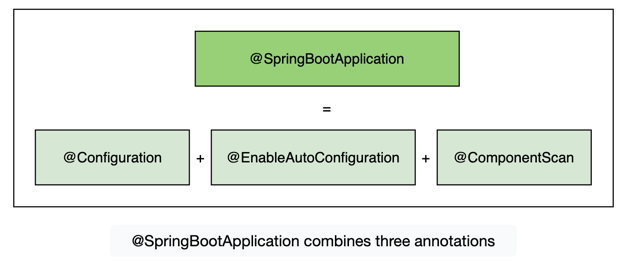
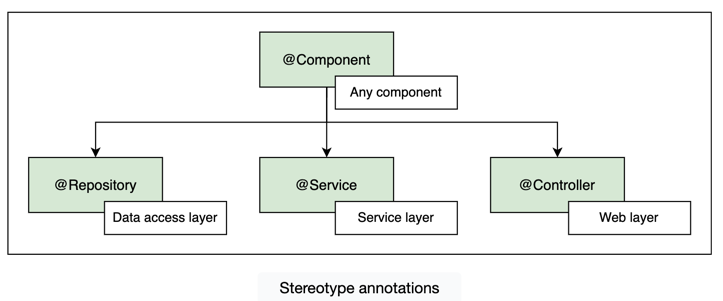
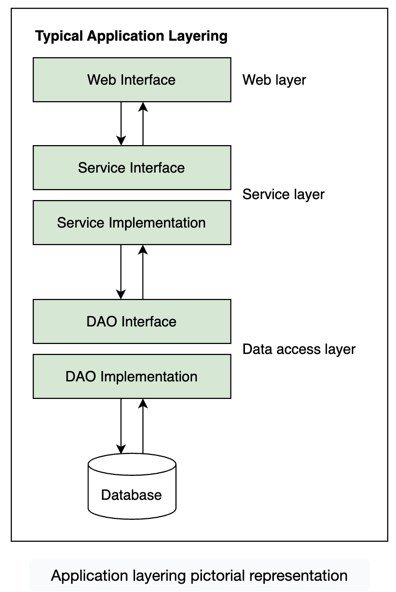
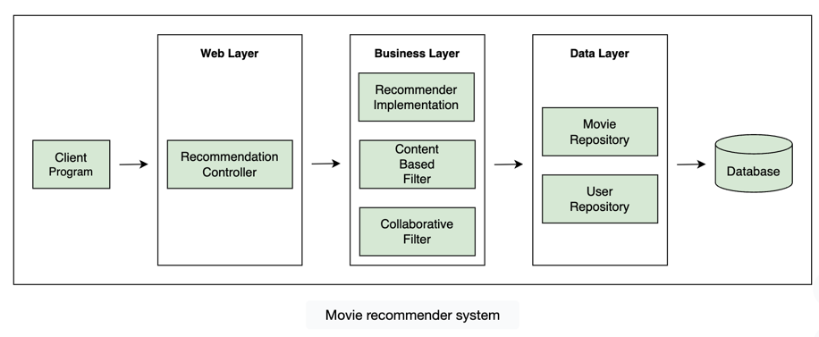

# Chapter 1


# Chapter 2


# Chapter 3
When `@Component` is put on class, it becomes a bean for container 


`@Autowired` annotation tells Spring that RecommenderImplementation needs an object of type Filter


third thing that Spring requires from the developer, is the location of the beans so that it can find them and autowire the dependencies. The @ComponentScan annotation is used for this purpose.
it scan a specific & subpackages.

`@SpringBootApplication` - This annotation is equivalent to the following three annotations

`@Configuration`, which declares a class as the source for bean definitions

`@EnableAutoConfiguration`, which allows the application to add beans using classpath definitions

`@ComponentScan`, which directs Spring to search for components in the path specified


# Chapter 5


`@Qualifier` annotation takes precedence over the `@Primary` annotation. To show this, let’s add the @Primary annotation.


If there is no `@Qualifier` specified on Components, but there is a `@Primary` mention, 
Component with `@Primary` will be injected as dependency.

# Chapter 7 
Bean scopes - bean scope refers to the lifecycle and the visibility of beans. It tells how long the bean lives, how many instances of the bean are created, and how the bean is shared. 
The singleton and prototype scopes can be used in any application while the last four scopes are only available for a web application.


# Chapter 8
Mixing singleton and prototype Beans


# Chapter 9 

`@ComponentScan` - 
Spring does a component scan to search for the beans that it manages. 
In a Spring application, the @ComponentScan annotation without any argument tells Spring to scan the current package as well as any sub-packages that might exist. 
Spring detects all classes marked with the` @Component, @Repository, @Service, and @Controller` annotations during component scan.



`@SpringBootApplication` by default, searches the package where it is present, as well as all the sub-packages. If a bean is present in a package other than the base package or its sub-packages, it will not be found.

If we want Spring to find beans defined in other packages, we need to use the @ComponentScan annotation and provide the path of the package where we want Spring to look for the beans.

`@ComponentScan(basePackages={"io.datajek.spring.basics.movierecommendersystem.lesson9",
"io.datajek.spring.basics.movierecommendersystem.lesson10"})`

```

@SpringBootApplication
//@ComponentScan(basePackages="io.datajek.spring.basics.movierecommendersystem.lesson10")
//@ComponentScan(includeFilters = @ComponentScan.Filter (type= FilterType.REGEX, pattern="io.datajek.spring.basics.movierecommendersystem.lesson9.*"))
public class MovieRecommenderSystemApplication {

	public static void main(String[] args) {
		
		//ApplicationContext manages the beans and dependencies
		ApplicationContext appContext = SpringApplication.run(MovieRecommenderSystemApplication.class, args);

		//check if beans are found
		System.out.println("CollaborativeFilter bean found = " + appContext.containsBean("collaborativeFilter"));
		System.out.println("ContentBasedFilter bean found = " + appContext.containsBean("contentBasedFilter"));
	}
}
``` 

# Chapter 10 
Lifecycle of prototype beans
Spring manages the entire lifecycle of singleton beans but it does not completely manage the lifecycle of prototype beans. This is because there might be a large number of prototype instances and the container can become overwhelmed keeping track of them.
Note: The Spring container creates the prototype beans and hands them over when requested. Thereafter, it is the responsibility of the application to destroy the bean and free up any resources that it has acquired.

# Chapter 11

Contexts and Dependency Injection (CDI) is an interface that standardizes dependency injection for Java EE. It defines different annotations for dependency injection like @Named, @Inject, @Scope, @Singleton, etc. Different CDI implementation frameworks provide support and functionality for these annotations.

# Chapter 12
Stereotype Annotations





