# Chapter 1

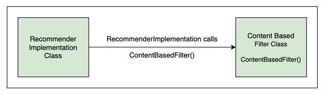

# Chapter 2

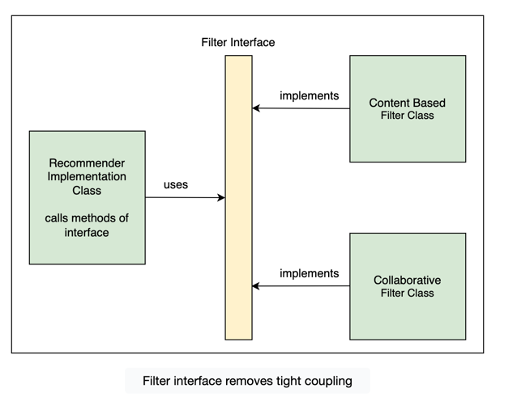

# Chapter 3
When `@Component` is put on class, it becomes a bean for container 
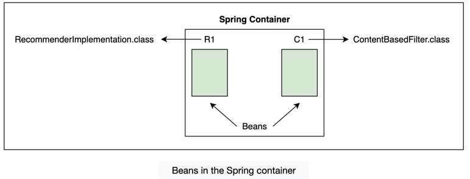

`@Autowired` annotation tells Spring that RecommenderImplementation needs an object of type Filter
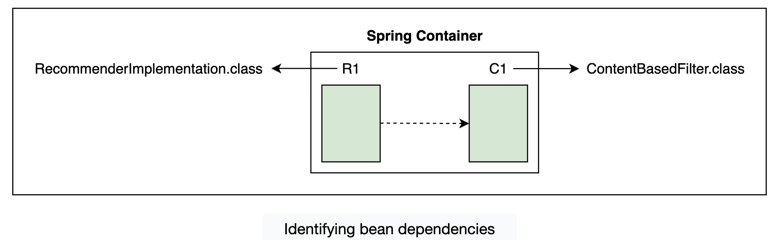

third thing that Spring requires from the developer, is the location of the beans so that it can find them and autowire the dependencies. The @ComponentScan annotation is used for this purpose.
it scan a specific & subpackages.

`@SpringBootApplication` - This annotation is equivalent to the following three annotations

`@Configuration`, which declares a class as the source for bean definitions

`@EnableAutoConfiguration`, which allows the application to add beans using classpath definitions

`@ComponentScan`, which directs Spring to search for components in the path specified

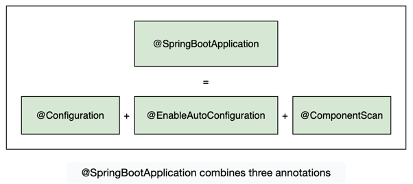

# Chapter 5

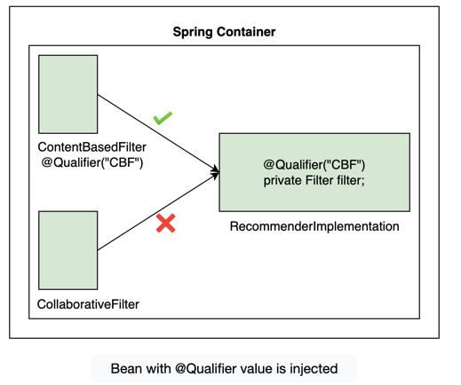

`@Qualifier` annotation takes precedence over the `@Primary` annotation. To show this, let’s add the @Primary annotation.

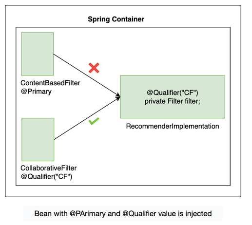

If there is no `@Qualifier` specified on Components, but there is a `@Primary` mention, 
Component with `@Primary` will be injected as dependency.

# Chapter 7 
Bean scopes - bean scope refers to the lifecycle and the visibility of beans. It tells how long the bean lives, how many instances of the bean are created, and how the bean is shared. 
The singleton and prototype scopes can be used in any application while the last four scopes are only available for a web application.
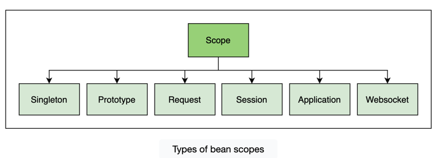

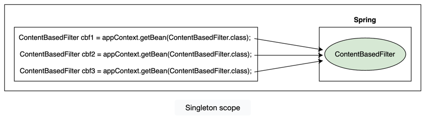

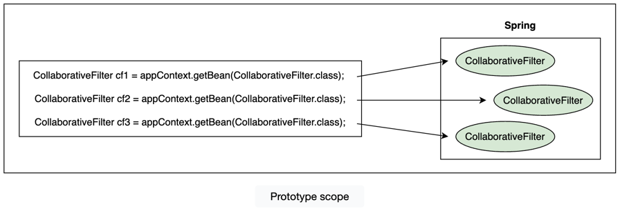

# Chapter 8
Mixing singleton and prototype Beans
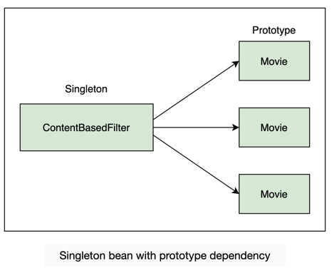

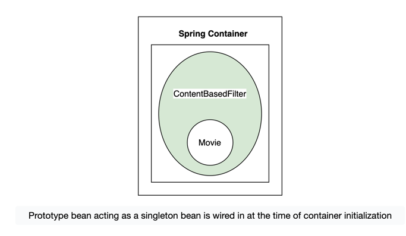

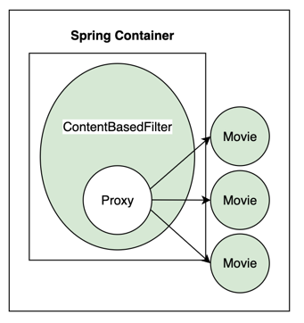